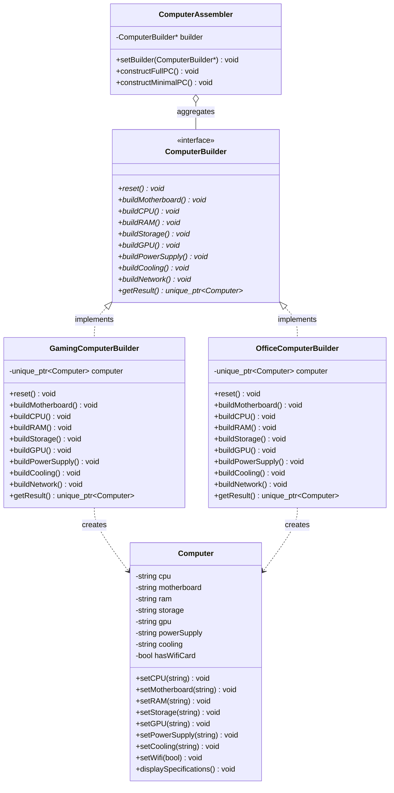
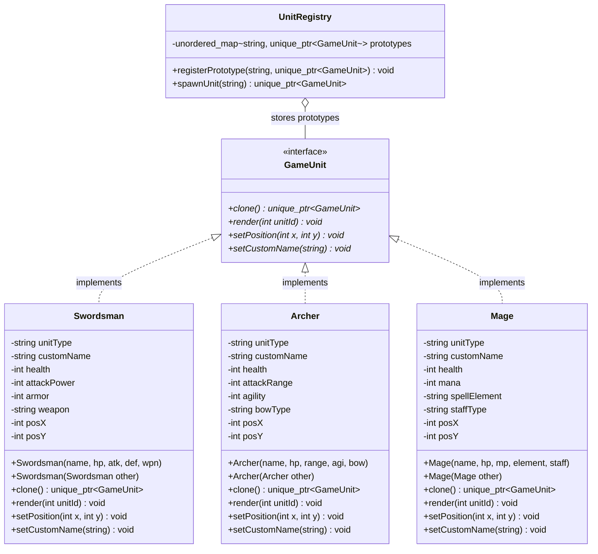

<div align="center">

*Heaven's Light is Our Guide*

# Rajshahi University of Engineering and Technology
### Department of Computer Science & Engineering


# LAB REPORT
### **(Lab 3: Design Pattern Analysis, Implementation and Code Review)**

</div>

---

### Course & Experiment Information

| Field | Details |
| :--- | :--- |
| **Course Title** | Software Engineering Sessional |
| **Course Code** | CSE 3206 |
| **Name of the Experiment** | Lab 3: Design Pattern Analysis, Implementation and Code Review |
| **Assigned Group** | Group 2 (Builder Pattern & Prototype Pattern) |
| **Date of Submission** | 28.09.2026 |

---

### Submission Details

| Submitted By | Submitted To |
| :--- | :--- |
| **Group :** Group 2<br>**Section :** C &nbsp;&nbsp;&nbsp;&nbsp; **Series :** 2022<br><br>**Team Members:**<br>1. **2203124** — Ishtiak Ahmed Anan<br>2. **2203125** — Sayed Shafaque bin Nur<br>3. **2203126** — Labib Shahriar Mahi | **Farjana Parvin**<br>Assistant Professor<br>Department of Computer Science & Engineering<br>Rajshahi University of Engineering and Technology (RUET) |

---

### Remarks
| Remarks |
| :--- |
| *Instructor's feedback / grade verification*<br><br><br> |

<div style="page-break-after: always;"></div>

---

# PART I: BUILDER DESIGN PATTERN

### 1. Pattern Name
**Builder Pattern**

### 2. Category
**Creational Design Pattern**

### 3. Intent
The Builder Pattern separates the construction of a complex object from its representation, allowing the exact same construction process to produce diverse types and configurations of an object. It encapsulates the assembly logic step-by-step rather than requiring clients to pass an overwhelming number of arguments to a constructor.

### 4. Problem Statement
In software development, objects often grow complex, containing dozens of configurable properties—some mandatory and many optional. In our real-world scenario of a **Custom Desktop Computer Assembly System**, an assembled PC contains: Motherboard, Processor, RAM, Storage (NVMe/SATA), dedicated GPU, Power Supply Unit (PSU), Liquid/Air Cooling, and Wi-Fi modules.

A traditional approach using constructors presents significant issues:
1. **Telescoping Constructor Anti-Pattern:** Creating multiple overloaded constructors with 5, 6, 7, or 8+ parameters becomes unmaintainable and highly prone to error.
2. **Type Confusion:** Multiple adjacent arguments of identical types (e.g., several `std::string` or `int` parameters) lead to bugs when arguments are accidentally swapped.
3. **Inconsistent Object State:** If public setters are used instead of constructors, the object is exposed in a partially initialized, inconsistent state during construction.

### 5. Motivation: Why Normal Implementation is Poor
Consider the traditional constructor implementation:
```cpp
Computer pc("ASUS Z790", "Intel i9", "64GB DDR5", "2TB NVMe", "RTX 4090", "1000W", "AIO Cooler", true);
```
If a customer wants a basic office PC without a dedicated GPU or liquid cooling:
```cpp
Computer officePC("MSI B760", "Intel i5", "16GB", "512GB", "", "550W", "Stock Fan", false);
```
- The caller is forced to pass dummy empty strings or null pointers for components not needed.
- If new components are introduced (e.g., Sound Card, Bluetooth), every existing constructor signature breaks, directly violating the **Open/Closed Principle (OCP)**.
- The Builder Pattern solves this by delegating construction to dedicated builder objects and driving the assembly step-by-step.

### 6. Pattern Structure (UML Class Diagram)



### 7. Class Responsibilities
1. **`Computer` (Product):** The complex domain object containing hardware properties and the `displaySpecifications()` presentation method.
2. **`ComputerBuilder` (Builder Interface):** Declares abstract construction steps (`buildCPU()`, `buildGPU()`, `buildRAM()`, etc.) and `getResult()`.
3. **`GamingComputerBuilder` (Concrete Builder 1):** Implements `ComputerBuilder` with top-tier gaming parts (Intel i9, RTX 4090, 64GB DDR5, 360mm AIO liquid cooling).
4. **`OfficeComputerBuilder` (Concrete Builder 2):** Implements `ComputerBuilder` with cost-effective, energy-efficient office parts (Intel i5, integrated GPU, stock air cooling).
5. **`ComputerAssembler` (Director):** Encapsulates the execution order of construction steps. Offers high-level routines (`constructFullPC()`, `constructMinimalPC()`).
6. **`Client` (`main`):** Configures the Director with the desired Builder, initiates construction, and retrieves the fully initialized product.

### 8. Code Implementation (C++17)
```cpp
/**
 * CSE 3206 Software Engineering Sessional
 * Lab 3: Design Pattern Analysis, Implementation and Code Review
 * Group 2: Builder Pattern Implementation
 *
 * Real-world Scenario: Custom Desktop Computer Assembly System
 */

#include <iostream>
#include <string>
#include <memory>
#include <iomanip>

// ==========================================
// 1. PRODUCT
// The complex object under construction.
// ==========================================
class Computer {
private:
    std::string cpu;
    std::string motherboard;
    std::string ram;
    std::string storage;
    std::string gpu;
    std::string powerSupply;
    std::string cooling;
    bool hasWifiCard = false;

public:
    // Setters used by the Builder
    void setCPU(const std::string& val) { cpu = val; }
    void setMotherboard(const std::string& val) { motherboard = val; }
    void setRAM(const std::string& val) { ram = val; }
    void setStorage(const std::string& val) { storage = val; }
    void setGPU(const std::string& val) { gpu = val; }
    void setPowerSupply(const std::string& val) { powerSupply = val; }
    void setCooling(const std::string& val) { cooling = val; }
    void setWifi(bool val) { hasWifiCard = val; }

    void displaySpecifications() const {
        std::cout << "--------------------------------------------------\n";
        std::cout << "             COMPUTER SPECIFICATIONS              \n";
        std::cout << "--------------------------------------------------\n";
        std::cout << "  Motherboard : " << motherboard << "\n";
        std::cout << "  Processor   : " << cpu << "\n";
        std::cout << "  RAM         : " << ram << "\n";
        std::cout << "  Storage     : " << storage << "\n";
        std::cout << "  Graphics    : " << gpu << "\n";
        std::cout << "  Power Supply: " << powerSupply << "\n";
        std::cout << "  Cooling     : " << cooling << "\n";
        std::cout << "  Wi-Fi Card  : " << (hasWifiCard ? "Installed" : "None") << "\n";
        std::cout << "--------------------------------------------------\n\n";
    }
};

// ==========================================
// 2. BUILDER INTERFACE
// Declares step-by-step construction methods.
// ==========================================
class ComputerBuilder {
public:
    virtual ~ComputerBuilder() = default;
    virtual void reset() = 0;
    virtual void buildMotherboard() = 0;
    virtual void buildCPU() = 0;
    virtual void buildRAM() = 0;
    virtual void buildStorage() = 0;
    virtual void buildGPU() = 0;
    virtual void buildPowerSupply() = 0;
    virtual void buildCooling() = 0;
    virtual void buildNetwork() = 0;
    virtual std::unique_ptr<Computer> getResult() = 0;
};

// ==========================================
// 3. CONCRETE BUILDER 1: Gaming PC Builder
// High-performance dedicated components.
// ==========================================
class GamingComputerBuilder : public ComputerBuilder {
private:
    std::unique_ptr<Computer> computer;

public:
    GamingComputerBuilder() { reset(); }

    void reset() override {
        computer = std::make_unique<Computer>();
    }

    void buildMotherboard() override {
        computer->setMotherboard("ASUS ROG Maximus Z790 Hero");
    }

    void buildCPU() override {
        computer->setCPU("Intel Core i9-14900K (24 cores, 6.0 GHz)");
    }

    void buildRAM() override {
        computer->setRAM("64 GB (2 x 32GB) DDR5-6000 MHz RGB");
    }

    void buildStorage() override {
        computer->setStorage("2 TB Samsung 990 PRO NVMe PCIe 4.0 SSD");
    }

    void buildGPU() override {
        computer->setGPU("NVIDIA GeForce RTX 4090 24GB GDDR6X");
    }

    void buildPowerSupply() override {
        computer->setPowerSupply("Corsair RM1000x 1000W 80+ Gold Fully Modular");
    }

    void buildCooling() override {
        computer->setCooling("NZXT Kraken Elite 360 RGB Liquid Cooler");
    }

    void buildNetwork() override {
        computer->setWifi(true);
    }

    std::unique_ptr<Computer> getResult() override {
        std::unique_ptr<Computer> result = std::move(computer);
        reset(); // Reset builder for next construction
        return result;
    }
};

// ==========================================
// 4. CONCRETE BUILDER 2: Office PC Builder
// Cost-effective, reliable business setup.
// ==========================================
class OfficeComputerBuilder : public ComputerBuilder {
private:
    std::unique_ptr<Computer> computer;

public:
    OfficeComputerBuilder() { reset(); }

    void reset() override {
        computer = std::make_unique<Computer>();
    }

    void buildMotherboard() override {
        computer->setMotherboard("MSI PRO B760M-A WiFi DDR4");
    }

    void buildCPU() override {
        computer->setCPU("Intel Core i5-13400 (10 cores, 4.6 GHz)");
    }

    void buildRAM() override {
        computer->setRAM("16 GB (2 x 8GB) DDR4-3200 MHz");
    }

    void buildStorage() override {
        computer->setStorage("512 GB Kingston NV2 PCIe 4.0 NVMe SSD");
    }

    void buildGPU() override {
        computer->setGPU("Integrated Intel UHD Graphics 730");
    }

    void buildPowerSupply() override {
        computer->setPowerSupply("Corsair CV550 550W 80+ Bronze");
    }

    void buildCooling() override {
        computer->setCooling("Intel Stock Air Cooler");
    }

    void buildNetwork() override {
        computer->setWifi(true);
    }

    std::unique_ptr<Computer> getResult() override {
        std::unique_ptr<Computer> result = std::move(computer);
        reset();
        return result;
    }
};

// ==========================================
// 5. DIRECTOR
// Defines the sequence of construction steps.
// ==========================================
class ComputerAssembler {
private:
    ComputerBuilder* builder;

public:
    void setBuilder(ComputerBuilder* b) {
        builder = b;
    }

    // Construct a complete standard configuration
    void constructFullPC() {
        if (!builder) return;
        builder->reset();
        builder->buildMotherboard();
        builder->buildCPU();
        builder->buildRAM();
        builder->buildStorage();
        builder->buildGPU();
        builder->buildPowerSupply();
        builder->buildCooling();
        builder->buildNetwork();
    }

    // Construct a minimal budget/headless server configuration
    void constructMinimalPC() {
        if (!builder) return;
        builder->reset();
        builder->buildMotherboard();
        builder->buildCPU();
        builder->buildRAM();
        builder->buildStorage();
        builder->buildPowerSupply();
    }
};

// ==========================================
// 6. CLIENT CODE (main)
// Demonstrates how client interacts with Director & Builders.
// ==========================================
int main() {
    std::cout << "========================================================\n";
    std::cout << "       CSE 3206 LAB 3 - BUILDER PATTERN DEMO           \n";
    std::cout << "========================================================\n\n";

    ComputerAssembler assembler;

    // 1. Building a High-End Gaming PC via Director
    std::cout << "[Step 1] Assembling High-End Gaming PC via Director...\n";
    GamingComputerBuilder gamingBuilder;
    assembler.setBuilder(&gamingBuilder);
    assembler.constructFullPC();
    std::unique_ptr<Computer> gamingPC = gamingBuilder.getResult();
    gamingPC->displaySpecifications();

    // 2. Building a Standard Office PC via Director
    std::cout << "[Step 2] Assembling Standard Office Workstation via Director...\n";
    OfficeComputerBuilder officeBuilder;
    assembler.setBuilder(&officeBuilder);
    assembler.constructFullPC();
    std::unique_ptr<Computer> officePC = officeBuilder.getResult();
    officePC->displaySpecifications();

    // 3. Custom assembly without Director (Client directly driving Builder)
    std::cout << "[Step 3] Custom Customization: Assembling Custom Barebones Server...\n";
    officeBuilder.reset();
    officeBuilder.buildMotherboard();
    officeBuilder.buildCPU();
    officeBuilder.buildRAM();
    officeBuilder.buildStorage();
    officeBuilder.buildPowerSupply();
    // Intentionally skipped GPU, RGB cooling, Wi-Fi card
    std::unique_ptr<Computer> customServer = officeBuilder.getResult();
    customServer->displaySpecifications();

    std::cout << "Builder Pattern demonstration executed successfully.\n";
    return 0;
}

```

### 9. Execution Flow
1. **Initialization:** The Client creates a Director (`ComputerAssembler`) and a Concrete Builder (e.g., `GamingComputerBuilder`).
2. **Configuration:** The Client binds the builder to the director via `assembler.setBuilder(&gamingBuilder)`.
3. **Step-by-Step Construction:** The Director calls `constructFullPC()`, which sequentially invokes `reset()`, `buildMotherboard()`, `buildCPU()`, `buildRAM()`, `buildStorage()`, `buildGPU()`, `buildPowerSupply()`, `buildCooling()`, and `buildNetwork()`.
4. **Product Extraction:** The Client calls `gamingBuilder.getResult()`, which moves the completed `Computer` instance out and resets the builder's internal state.
5. **Custom Flow (Director-Free):** The Client can also bypass the Director to build custom bespoke variations (e.g., barebones headless server) by calling builder steps directly.

### 10. Advantages
- **Fine-Grained Step Control:** Allows constructing objects step-by-step, deferring steps, or running steps recursively.
- **Single Responsibility Principle (SRP):** Isolates complex assembly logic from the business logic of the product class.
- **Open/Closed Principle (OCP):** New computer representations (e.g., `ServerComputerBuilder`, `WorkstationBuilder`) can be introduced without modifying existing client or director code.
- **Avoids Telescoping Constructors:** Eliminates cumbersome constructors with excessive parameters and default nulls.

### 11. Limitations
- **Increased Class Count:** Requires creating an interface, multiple concrete builders, and a director, increasing boilerplate for simple objects.
- **Tight Product Coupling:** The concrete builders are typically coupled to the specific methods and fields of the product class.

### 12. Real-Life Applications
- **Custom PC / Automobile Configurators:** Assembling custom hardware setups or car options (engine, wheels, interior package).
- **Document / Report Generation:** Assembling complex multi-section documents into PDF, HTML, or Markdown.
- **SQL / Query Builders:** Dynamically appending `SELECT`, `WHERE`, `JOIN`, and `ORDER BY` clauses.

### 13. Industry Examples
- **Java Platform:** `java.lang.StringBuilder`, `java.nio.ByteBuffer.allocate()`.
- **Android SDK:** `android.app.AlertDialog.Builder`.
- **Spring Framework:** `UriComponentsBuilder`, `MockMvcRequestBuilders`.
- **Apache Commons / HTTP:** `org.apache.http.client.methods.RequestBuilder`.

### 14. Demonstration (Live Execution Output)
```text
========================================================
       CSE 3206 LAB 3 - BUILDER PATTERN DEMO           
========================================================

[Step 1] Assembling High-End Gaming PC via Director...
--------------------------------------------------
             COMPUTER SPECIFICATIONS              
--------------------------------------------------
  Motherboard : ASUS ROG Maximus Z790 Hero
  Processor   : Intel Core i9-14900K (24 cores, 6.0 GHz)
  RAM         : 64 GB (2 x 32GB) DDR5-6000 MHz RGB
  Storage     : 2 TB Samsung 990 PRO NVMe PCIe 4.0 SSD
  Graphics    : NVIDIA GeForce RTX 4090 24GB GDDR6X
  Power Supply: Corsair RM1000x 1000W 80+ Gold Fully Modular
  Cooling     : NZXT Kraken Elite 360 RGB Liquid Cooler
  Wi-Fi Card  : Installed
--------------------------------------------------

[Step 2] Assembling Standard Office Workstation via Director...
--------------------------------------------------
             COMPUTER SPECIFICATIONS              
--------------------------------------------------
  Motherboard : MSI PRO B760M-A WiFi DDR4
  Processor   : Intel Core i5-13400 (10 cores, 4.6 GHz)
  RAM         : 16 GB (2 x 8GB) DDR4-3200 MHz
  Storage     : 512 GB Kingston NV2 PCIe 4.0 NVMe SSD
  Graphics    : Integrated Intel UHD Graphics 730
  Power Supply: Corsair CV550 550W 80+ Bronze
  Cooling     : Intel Stock Air Cooler
  Wi-Fi Card  : Installed
--------------------------------------------------

[Step 3] Custom Customization: Assembling Custom Barebones Server...
--------------------------------------------------
             COMPUTER SPECIFICATIONS              
--------------------------------------------------
  Motherboard : MSI PRO B760M-A WiFi DDR4
  Processor   : Intel Core i5-13400 (10 cores, 4.6 GHz)
  RAM         : 16 GB (2 x 8GB) DDR4-3200 MHz
  Storage     : 512 GB Kingston NV2 PCIe 4.0 NVMe SSD
  Graphics    : 
  Power Supply: Corsair CV550 550W 80+ Bronze
  Cooling     : 
  Wi-Fi Card  : None
--------------------------------------------------

Builder Pattern demonstration executed successfully.

```

### 15. Conclusion
The Builder Pattern is essential when creating complex aggregate objects whose construction must be decoupled from their representation. It ensures compile-time type safety, eliminates parameter ambiguity, and enforces clean modular design.

---

# PART II: PROTOTYPE DESIGN PATTERN

### 1. Pattern Name
**Prototype Pattern**

### 2. Category
**Creational Design Pattern**

### 3. Intent
The Prototype Pattern specifies the kinds of objects to create using a prototypical instance and creates new objects by copying this prototype via a `clone()` method. It decouples the client from concrete instantiation classes and eliminates the overhead of expensive initialization.

### 4. Problem Statement
In real-time interactive systems such as Video Game Engines (RTS / RPG), Simulation Systems, and CAD software, creating complex objects from scratch is computationally expensive.
For instance, initializing an enemy NPC unit (`Swordsman`, `Archer`, `Mage`) involves:
1. Loading 3D meshes, textures, animations, and sound effects from disk.
2. Parsing skill trees, base stats, armor resistances, and weapons from database/config files.
3. Allocating multiple internal memory buffers.

Calling `new Swordsman(...)` 100 times per battle causes unacceptable frame rate drops and CPU stutter. Furthermore, the client spawner code becomes tightly coupled to each concrete class constructor.

### 5. Motivation: Why Normal Implementation is Poor
- **Expensive Re-initialization:** Re-parsing files, re-loading assets, and re-calculating initial matrices for identical objects wastes memory and CPU cycles.
- **Coupling to Concrete Classes:** If the game client spawns units dynamically based on level events, it must know concrete class names (`new Swordsman()`, `new Archer()`), violating the **Dependency Inversion Principle (DIP)**.
- **Cloning Polymorphic Pointers:** In C++, if you only have a pointer to the base interface `GameUnit*`, you cannot invoke `new` on the underlying derived class because the compiler does not know the dynamic runtime type. The Prototype pattern's virtual `clone()` solves this cleanly via polymorphic copy construction.

### 6. Pattern Structure (UML Class Diagram)



### 7. Class Responsibilities
1. **`GameUnit` (Prototype Interface):** Declares the virtual destructor and pure virtual `clone()` method, alongside gameplay operations (`render()`, `setPosition()`, `setCustomName()`).
2. **`Swordsman` (Concrete Prototype 1):** Stores heavy combat attributes and implements `clone()` using its C++ copy constructor to return an exact replica.
3. **`Archer` (Concrete Prototype 2):** Stores ranged combat data and provides its own `clone()` implementation.
4. **`Mage` (Concrete Prototype 3):** Stores mana and elemental spell configurations with dedicated `clone()` behavior.
5. **`UnitRegistry` (Prototype Registry / Cache):** Manages a dictionary of pre-initialized prototypical instances. Provides a factory method `spawnUnit(key)` that clones the requested prototype on demand.
6. **`Client` (`main`):** Registers master prototypes into the registry, spawns clones dynamically on the battlefield, modifies runtime coordinates, and renders the army.

### 8. Code Implementation (C++17)
```cpp
/**
 * CSE 3206 Software Engineering Sessional
 * Lab 3: Design Pattern Analysis, Implementation and Code Review
 * Group 2: Prototype Pattern Implementation
 *
 * Real-world Scenario: Game Character / Unit Spawning Engine (RTS/RPG)
 */

#include <iostream>
#include <string>
#include <memory>
#include <unordered_map>
#include <vector>

// ==========================================
// 1. PROTOTYPE INTERFACE
// Declares the clone() method.
// ==========================================
class GameUnit {
public:
    virtual ~GameUnit() = default;
    
    // Core Prototype clone interface (pure virtual)
    virtual std::unique_ptr<GameUnit> clone() const = 0;
    
    // Presentation / gameplay method
    virtual void render(int unitId) const = 0;
    
    // Dynamic runtime customization
    virtual void setPosition(int x, int y) = 0;
    virtual void setCustomName(const std::string& name) = 0;
};

// ==========================================
// 2. CONCRETE PROTOTYPE 1: Swordsman / Warrior
// ==========================================
class Swordsman : public GameUnit {
private:
    std::string unitType;
    std::string customName;
    int health;
    int attackPower;
    int armor;
    std::string weapon;
    int posX = 0;
    int posY = 0;

public:
    Swordsman(const std::string& name, int hp, int atk, int def, const std::string& wpn)
        : unitType("Swordsman"), customName(name), health(hp), attackPower(atk), armor(def), weapon(wpn) {
        // Simulating expensive initialization (asset loading, audio preload, skill tree compilation)
    }

    // Copy constructor used for cloning
    Swordsman(const Swordsman& other)
        : unitType(other.unitType),
          customName(other.customName),
          health(other.health),
          attackPower(other.attackPower),
          armor(other.armor),
          weapon(other.weapon),
          posX(other.posX),
          posY(other.posY) {}

    // Implement clone() using copy constructor
    std::unique_ptr<GameUnit> clone() const override {
        return std::make_unique<Swordsman>(*this);
    }

    void setPosition(int x, int y) override {
        posX = x;
        posY = y;
    }

    void setCustomName(const std::string& name) override {
        customName = name;
    }

    void render(int unitId) const override {
        std::cout << "  [Unit #" << unitId << " - " << unitType << "] \"" << customName << "\"\n"
                  << "    Stats : HP=" << health << " | ATK=" << attackPower << " | ARMOR=" << armor << "\n"
                  << "    Weapon: " << weapon << "\n"
                  << "    Coord : (" << posX << ", " << posY << ")\n\n";
    }
};

// ==========================================
// 3. CONCRETE PROTOTYPE 2: Archer
// ==========================================
class Archer : public GameUnit {
private:
    std::string unitType;
    std::string customName;
    int health;
    int attackRange;
    int agility;
    std::string bowType;
    int posX = 0;
    int posY = 0;

public:
    Archer(const std::string& name, int hp, int range, int agi, const std::string& bow)
        : unitType("Archer"), customName(name), health(hp), attackRange(range), agility(agi), bowType(bow) {}

    Archer(const Archer& other)
        : unitType(other.unitType),
          customName(other.customName),
          health(other.health),
          attackRange(other.attackRange),
          agility(other.agility),
          bowType(other.bowType),
          posX(other.posX),
          posY(other.posY) {}

    std::unique_ptr<GameUnit> clone() const override {
        return std::make_unique<Archer>(*this);
    }

    void setPosition(int x, int y) override {
        posX = x;
        posY = y;
    }

    void setCustomName(const std::string& name) override {
        customName = name;
    }

    void render(int unitId) const override {
        std::cout << "  [Unit #" << unitId << " - " << unitType << "] \"" << customName << "\"\n"
                  << "    Stats : HP=" << health << " | RANGE=" << attackRange << " | AGILITY=" << agility << "\n"
                  << "    Weapon: " << bowType << "\n"
                  << "    Coord : (" << posX << ", " << posY << ")\n\n";
    }
};

// ==========================================
// 4. CONCRETE PROTOTYPE 3: Mage / Sorcerer
// ==========================================
class Mage : public GameUnit {
private:
    std::string unitType;
    std::string customName;
    int health;
    int mana;
    std::string spellElement;
    std::string staffType;
    int posX = 0;
    int posY = 0;

public:
    Mage(const std::string& name, int hp, int mp, const std::string& element, const std::string& staff)
        : unitType("Mage"), customName(name), health(hp), mana(mp), spellElement(element), staffType(staff) {}

    Mage(const Mage& other)
        : unitType(other.unitType),
          customName(other.customName),
          health(other.health),
          mana(other.mana),
          spellElement(other.spellElement),
          staffType(other.staffType),
          posX(other.posX),
          posY(other.posY) {}

    std::unique_ptr<GameUnit> clone() const override {
        return std::make_unique<Mage>(*this);
    }

    void setPosition(int x, int y) override {
        posX = x;
        posY = y;
    }

    void setCustomName(const std::string& name) override {
        customName = name;
    }

    void render(int unitId) const override {
        std::cout << "  [Unit #" << unitId << " - " << unitType << "] \"" << customName << "\"\n"
                  << "    Stats : HP=" << health << " | MANA=" << mana << " | ELEMENT=" << spellElement << "\n"
                  << "    Weapon: " << staffType << "\n"
                  << "    Coord : (" << posX << ", " << posY << ")\n\n";
    }
};

// ==========================================
// 5. PROTOTYPE REGISTRY / SPAWN MANAGER
// Caches master prototypes and clones them on demand.
// ==========================================
class UnitRegistry {
private:
    std::unordered_map<std::string, std::unique_ptr<GameUnit>> prototypes;

public:
    void registerPrototype(const std::string& key, std::unique_ptr<GameUnit> prototype) {
        prototypes[key] = std::move(prototype);
    }

    // Creates a new unit instance by cloning the registered prototype
    std::unique_ptr<GameUnit> spawnUnit(const std::string& key) const {
        auto it = prototypes.find(key);
        if (it != prototypes.end()) {
            return it->second->clone(); // Returns deep cloned copy
        }
        std::cerr << "Error: Prototype with key '" << key << "' not registered!\n";
        return nullptr;
    }
};

// ==========================================
// 6. CLIENT CODE (main)
// Demonstrates fast spawning via cloning.
// ==========================================
int main() {
    std::cout << "========================================================\n";
    std::cout << "      CSE 3206 LAB 3 - PROTOTYPE PATTERN DEMO          \n";
    std::cout << "========================================================\n\n";

    // 1. Initializing and Registering Master Prototypes in Registry
    std::cout << "[Step 1] Loading and caching master unit prototypes...\n";
    UnitRegistry registry;

    registry.registerPrototype(
        "elite_swordsman",
        std::make_unique<Swordsman>("Royal Guard", 150, 45, 30, "Excalibur Greatsword")
    );

    registry.registerPrototype(
        "sniper_archer",
        std::make_unique<Archer>("Elven Marksman", 90, 80, 70, "Windrunner Longbow")
    );

    registry.registerPrototype(
        "pyro_mage",
        std::make_unique<Mage>("Archmage", 80, 200, "Firestorm", "Phoenix Staff")
    );

    std::cout << "Master prototypes successfully registered in memory.\n\n";

    // 2. Spawning Army Squad via Fast Cloning
    std::cout << "[Step 2] Spawning units on battlefield via Prototype cloning:\n";
    std::cout << "--------------------------------------------------------\n";

    std::vector<std::unique_ptr<GameUnit>> battlefieldArmy;

    // Clone 2 Swordsmen
    auto s1 = registry.spawnUnit("elite_swordsman");
    s1->setPosition(10, 20);
    s1->setCustomName("Vanguard Arthur");
    battlefieldArmy.push_back(std::move(s1));

    auto s2 = registry.spawnUnit("elite_swordsman");
    s2->setPosition(12, 22);
    s2->setCustomName("Vanguard Lancelot");
    battlefieldArmy.push_back(std::move(s2));

    // Clone 2 Archers
    auto a1 = registry.spawnUnit("sniper_archer");
    a1->setPosition(5, 50);
    a1->setCustomName("Scout Robin");
    battlefieldArmy.push_back(std::move(a1));

    auto a2 = registry.spawnUnit("sniper_archer");
    a2->setPosition(8, 52);
    a2->setCustomName("Scout Legolas");
    battlefieldArmy.push_back(std::move(a2));

    // Clone 1 Mage
    auto m1 = registry.spawnUnit("pyro_mage");
    m1->setPosition(2, 15);
    m1->setCustomName("Grand Wizard Gandalf");
    battlefieldArmy.push_back(std::move(m1));

    // 3. Render all deployed units
    int unitId = 1;
    for (const auto& unit : battlefieldArmy) {
        unit->render(unitId++);
    }

    std::cout << "--------------------------------------------------------\n";
    std::cout << "Prototype Pattern demonstration executed successfully.\n";
    std::cout << "Notice: All 5 units were instantiated via zero-overhead\n";
    std::cout << "cloning without repeating expensive initialization logic!\n";

    return 0;
}

```

### 9. Execution Flow
1. **Bootstrap / Registration:** During application startup, master units (`elite_swordsman`, `sniper_archer`, `pyro_mage`) are created once and stored in the `UnitRegistry`.
2. **Clone Request:** During runtime, the Client requests a new unit: `registry.spawnUnit("elite_swordsman")`.
3. **Deep Copy Execution:** The registry locates the master prototype and invokes its virtual `clone()` method. The derived class copy constructor creates a fresh duplicate in heap memory.
4. **Customization:** The Client mutates instance-specific attributes (`setPosition(10, 20)`, `setCustomName("Vanguard Arthur")`) without modifying the master template.
5. **Deployment:** The cloned unit is placed in the active game world vector and rendered.

### 10. Advantages
- **High Performance Object Creation:** Avoids re-executing heavy initialization, file parsing, and resource loading.
- **Polymorphic Copying:** Allows cloning objects without knowing their concrete implementation classes at compile-time.
- **Dynamic Configuration:** Master prototypes can be added, updated, or removed from the registry dynamically at runtime.
- **Reduces Subclassing:** Allows creating variations of objects by configuring prototypes rather than creating deep inheritance hierarchies.

### 11. Limitations
- **Deep Copy Complexity:** Cloning complex objects with circular references or pointer chains requires careful deep-copy management to avoid memory corruption or shallow alias bugs.

### 12. Real-Life Applications
- **Game Engine Spawning:** Generating hordes of enemies, projectiles, and particle systems from prototype prefabs.
- **GUI & Vector Graphics Editors:** Copy-pasting complex shapes, layers, and styled vector graphics (Adobe Illustrator, Figma).
- **Virtual Machine & Container Snapshots:** Cloning pre-configured VM snapshots or Docker containers.

### 13. Industry Examples
- **Java Standard Library:** `java.lang.Cloneable` interface and `Object.clone()`.
- **JavaScript Language Engine:** JavaScript's fundamental object-oriented model is prototype-based (`prototype` chain).
- **Unity Engine:** `Instantiate(prefab)` clones pre-configured game object prototypes.
- **Unreal Engine:** Actor spawning through Class Default Objects (CDO).

### 14. Demonstration (Live Execution Output)
```text
========================================================
      CSE 3206 LAB 3 - PROTOTYPE PATTERN DEMO          
========================================================

[Step 1] Loading and caching master unit prototypes...
Master prototypes successfully registered in memory.

[Step 2] Spawning units on battlefield via Prototype cloning:
--------------------------------------------------------
  [Unit #1 - Swordsman] "Vanguard Arthur"
    Stats : HP=150 | ATK=45 | ARMOR=30
    Weapon: Excalibur Greatsword
    Coord : (10, 20)

  [Unit #2 - Swordsman] "Vanguard Lancelot"
    Stats : HP=150 | ATK=45 | ARMOR=30
    Weapon: Excalibur Greatsword
    Coord : (12, 22)

  [Unit #3 - Archer] "Scout Robin"
    Stats : HP=90 | RANGE=80 | AGILITY=70
    Weapon: Windrunner Longbow
    Coord : (5, 50)

  [Unit #4 - Archer] "Scout Legolas"
    Stats : HP=90 | RANGE=80 | AGILITY=70
    Weapon: Windrunner Longbow
    Coord : (8, 52)

  [Unit #5 - Mage] "Grand Wizard Gandalf"
    Stats : HP=80 | MANA=200 | ELEMENT=Firestorm
    Weapon: Phoenix Staff
    Coord : (2, 15)

--------------------------------------------------------
Prototype Pattern demonstration executed successfully.
Notice: All 5 units were instantiated via zero-overhead
cloning without repeating expensive initialization logic!

```

### 15. Conclusion
The Prototype Pattern provides a lightweight, elegant solution for creating duplicates of pre-configured objects at runtime. When combined with a Prototype Registry, it drastically reduces object initialization overhead and eliminates tight coupling between client code and concrete classes.

---

# SUMMARY COMPARISON OF CREATIONAL DESIGN PATTERNS

| Feature / Criteria | Builder Pattern | Prototype Pattern | Factory Method | Abstract Factory |
|:---|:---|:---|:---|:---|
| **Primary Intent** | Construct complex objects step-by-step | Clone existing pre-configured objects | Subclasses decide which class to instantiate | Create families of related objects |
| **Object Complexity** | High (many parts, customizable) | High initialization cost, identical baseline | Single product instance | Multi-product suites |
| **Construction Mechanism** | Step-by-step method calls via Director/Fluent API | Copy constructor / clone method | Inheritance & factory method override | Object composition & abstract interface |
| **Key Advantage** | Eliminates telescoping constructors | Zero expensive re-initialization | Decouples creator from concrete product | Ensures product family compatibility |
| **When to Use** | Product has many optional configuration parts | Instantiating from scratch is slow or complex | Object creation logic varies by subclass | System needs to be independent of how products are created |
